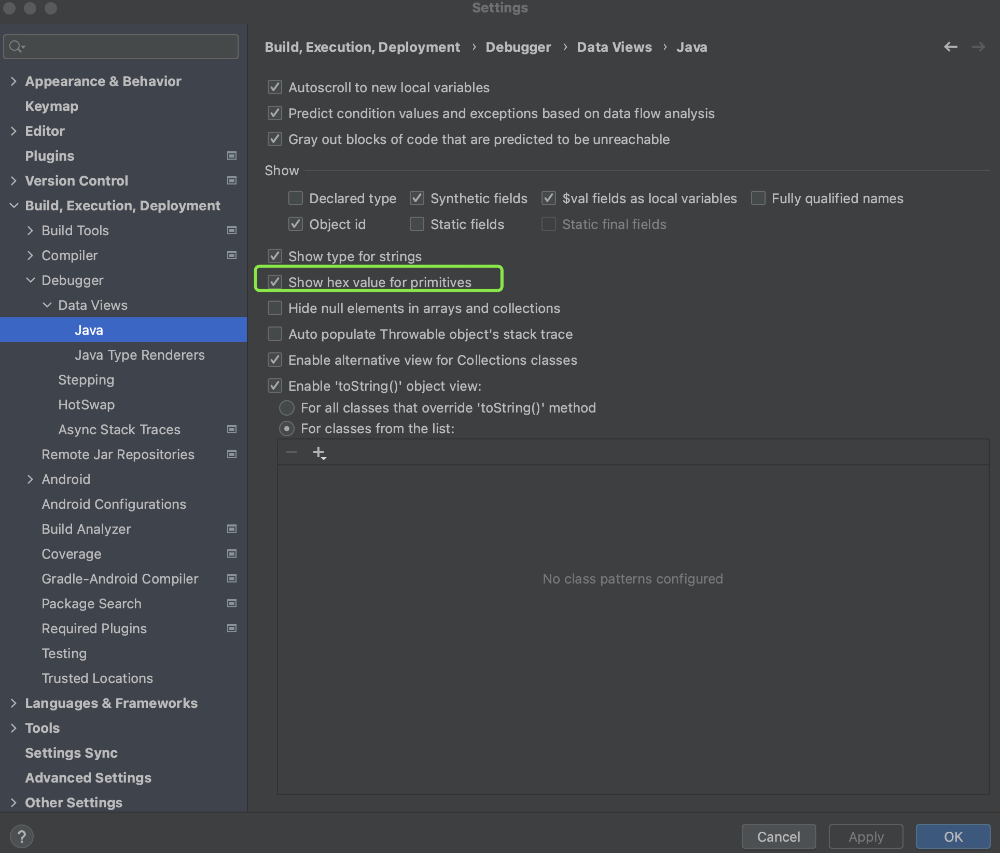
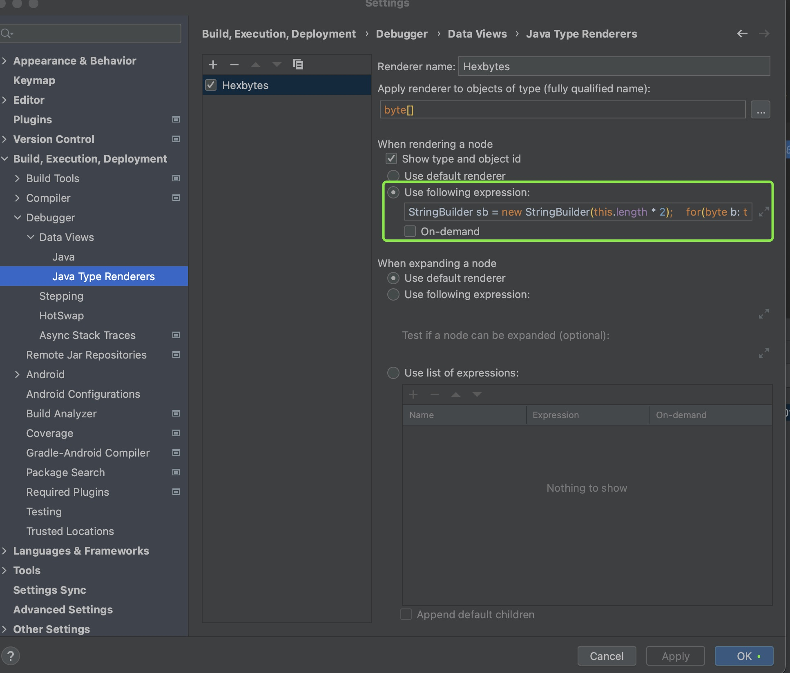

## Show byte[] as hex
in debug view, the IDE will show the byte and byte[] as decimal


## for primitives
* goto Settings -> Build,Executio,Deployment -> Debugger -> Data Views -> Java
* select 'Show hex value for primitives'



## for byte[]

1. create a new Renderer
2. give a name like HexByte
3. put the below code to 'Use Following expression'
```
StringBuilder sb = new StringBuilder(this.length * 2);
   for(byte b: this){sb.append(String.format(" 0x%02x", b));}
   return sb.toString();
```


