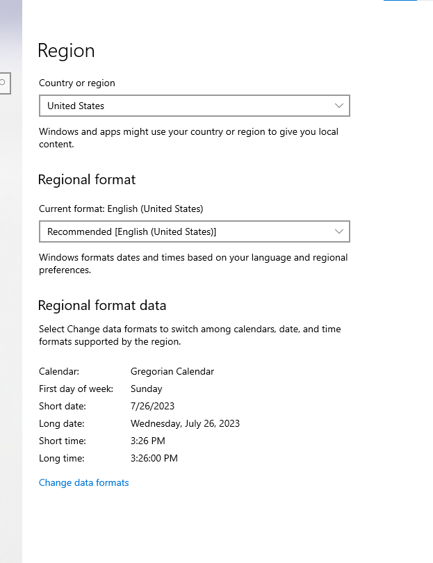
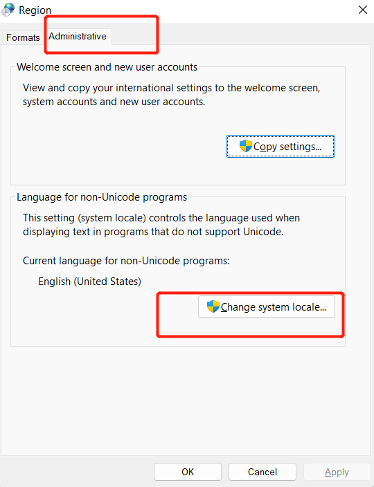
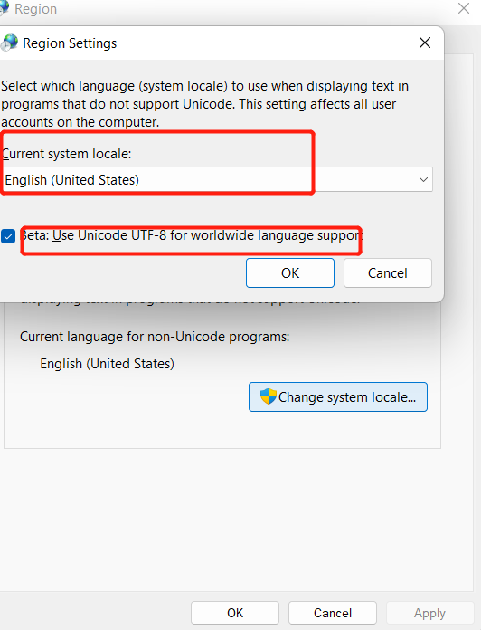

***
* the support uft8 on windows is not very good. if there is a emoji file in the ipa. and when we use zsign to code sign this ipa on windows. the ipa file couldn't be installed to iOS. we need enable the UFT8 support on windows first 

***

* for zsign, we need make sure widnwos is using the uft8

----

---

* and after reboot the windows, it will work.