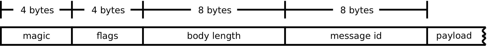
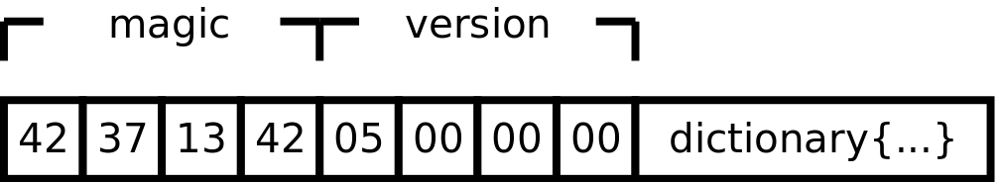

## RemoteXPC
* location at `/System/Library/PrivateFrameworks/RemoteXPC.framework/RemoteXPC`
* but we can not find the real binary only folders

* ·ifconfig VHC128 up· use  this cli to enable VHC128 then we could use wireshark.app to catch the packages between the iOS and Mac
* RPC that is being used seems to be something called Mercury (it's at /Library/Developer/PrivateFrameworks/Mercury.framework, and it's implement in Swift 
* As well as the new CoreDevice.framework, which is also in PrivateFrameworks
* CoreDevice also comes with a tool called devicectl, which (finally) allows to execute single actions like installing, pairing etc.
* 


CoreDevice also comes with a tool called devicectl, which (finally) allows to execute single actions like installing, pairing etc.

## remotectl
* Located in `/usr/libexec/remotectl`
* still do not know how to use it


## Message type
look like the message between Mac and iOS is using the MBIM [Mobile Broadband Interface Model](https://www.smithmicro.com/standards/mbim)


## XPC Wrapper Fields and Behavior
The XPC wrapper has the following structure, with fields in little-endian order:

```
struct XPC_Wrapper
{
    uint32_t magic;
    uint32_t flags;
    uint64_t body_len;
    uint64_t msg_id;
}
```
* Its magic bytes are 0x29B00B92

## XPC objects 


```
Types:
XPC_NULL              = 0x00001000
XPC_BOOL              = 0x00002000
XPC_INT64             = 0x00003000
XPC_UINT64            = 0x00004000
XPC_DOUBLE            = 0x00005000
XPC_POINTER           = 0x00006000
XPC_DATE              = 0x00007000
XPC_DATA              = 0x00008000
XPC_STRING            = 0x00009000
XPC_UUID              = 0x0000a000
XPC_FD                = 0x0000b000
XPC_SHMEM             = 0x0000c000
XPC_MACH_SEND         = 0x0000d000
XPC_ARRAY             = 0x0000e000
XPC_DICTIONARY        = 0x0000f000
XPC_ERROR             = 0x00010000
XPC_CONNECTION        = 0x00011000
XPC_ENDPOINT          = 0x00012000
XPC_SERIALIZER        = 0x00013000
XPC_PIPE              = 0x00014000
XPC_MACH_RECV         = 0x00015000
XPC_BUNDLE            = 0x00016000
XPC_SERVICE           = 0x00017000
XPC_SERVICE_INSTANCE  = 0x00018000
XPC_ACTIVITY          = 0x00019000
XPC_FILE_TRANSFER     = 0x0001a000
```


## resources
* https://duo.com/labs/research/apple-t2-xpc
* [pymobiledevice3 RemoteXPC](https://github.com/doronz88/pymobiledevice3/blob/master/misc/RemoteXPC.md)

