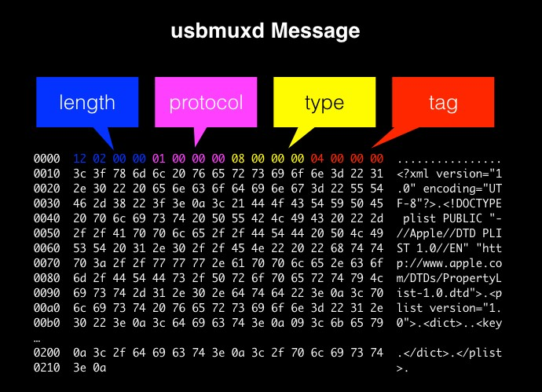
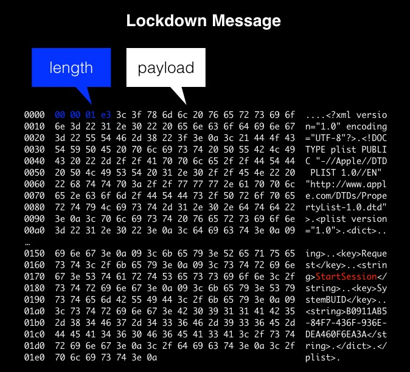

# Types of Messages

We can categorise the messages through the USBMUXD in four groups. Although we might see some other type of data packets formats, these are the ones we are interested in:

* USBMUXD Messages
* Lockdown Messages
* iOS Services Messages
* DTX Messages

All messages have in common that the payload is one or more PLIST, sometimes in binary format BPLIST. The header format before the payload is different.


# The USBMUXD Messages

These are the local messages to the usbmuxd daemon. Processed by the OSX usbmuxd daemon, do not reach the device. 

They are: Listen, Connect, ListDevices, ListListeners, ReadBUID, ReadPairRecord, SavePairRecord, DeletePairRecord. 

Non encrypted.

```
Header : 
MessageSize:475 PacketSize:475 Protocol:1 Type:8 Tag:13471

Payload:
<?xml version="1.0" encoding="UTF-8"?>
<!DOCTYPE plist PUBLIC "-//Apple//DTD PLIST 1.0//EN" "http://www.apple.com/DTDs/PropertyList-1.0.dtd">
<plist version="1.0">
<dict>
	<key>BundleID</key>
	<string>com.apple.dt.Xcode</string>
	<key>ClientVersionString</key>
	<string>usbmuxd-474.120.1</string>
	<key>MessageType</key>
	<string>ListDevices</string>
	<key>ProcessID</key>
	<integer>401</integer>
	<key>ProgName</key>
	<string>Xcode</string>
</dict>
</plist>
```



# The Lockdown Messages

Messages to the iOS Lockdown Service. They reach to the iOS Lockdown through port 62078. 

They are: StartSession, StopSession, StartService, GetValue. 

Once the start Session is requested the messages will will be SSL encrypted. **ATTENTION : SSL Encrypted**.


# The iOS Services Messages

These are the messages to the iOS services that have been opened using the StartService message to the lockdown service. (Read the previous page on "protocol" to understand the communication with iOS services.)

The format of the messages are basically the same as for the Lockdown messages.

ATTENTION. From iOS 13 the StartSession is SSL encrypted, but the consequent messages after the session starts might not be encrypted ! It depends on the service.

# The DTX Messages

## Messages beyond libimobiledevice 

The message we know so far are the ones that libimobiledevice tools use, which are the messages that Apps like iTunes, iMovies need. There is  a second type of messages, the DTX Messages. These type of messages are the ones that Apple uses to communicate with the instrumentation services and the test manager. 

Groups of Messages by complexity:

* Messages for iTunes like operations (install/remove, get/set data)
* Messages of Xcode (instruments) (DTX messages)

The libimobiledevice tools that we know are in the iTunes scope. Although the libimobiledevice guys know and have tools for the DTX messages tools, they do not make it public. There are no public tools to launch Apps or run XCTest tests or get instrumentation information.

**The reason behind the DTX message is the need to describe Objective function calls.** DTX messages are based in Apple internal NSKeyedArchive serialisation.

## DTX Message Examples

A Dtrace log a simple DTX message incoming from the iDevice:

```
TIMESTAMP           UID    PID CMD          D   BYTES SOCKET
1486632630580757    501  76163 xcodebuild   R     187 27 (com.apple.testmanagerd.lockdown)
             0  1  2  3  4  5  6  7  8  9  a  b  c  d  e  f  0123456789abcdef
         0: 79 5b 3d 1f 20 00 00 00 00 00 01 00 9b 00 00 00  y[=. ...........
        10: 04 00 00 00 01 00 00 00 01 00 00 00 00 00 00 00  ................
        20: 03 00 00 00 00 00 00 00 8b 00 00 00 00 00 00 00  ................
        30: 62 70 6c 69 73 74 30 30 d4 01 02 03 04 05 06 09  bplist00........
        40: 0a 58 24 76 65 72 73 69 6f 6e 58 24 6f 62 6a 65  .X$versionX$obje
        50: 63 74 73 59 24 61 72 63 68 69 76 65 72 54 24 74  ctsY$archiverT$t
        60: 6f 70 12 00 01 86 a0 a2 07 08 55 24 6e 75 6c 6c  op........U$null
        70: 10 16 5f 10 0f 4e 53 4b 65 79 65 64 41 72 63 68  .._..NSKeyedArch
        80: 69 76 65 72 d1 0b 0c 54 72 6f 6f 74 80 01 08 11  iver...Troot....
        90: 1a 23 2d 32 37 3a 40 42 54 57 5c 00 00 00 00 00  .#-27:@BTW\.....
        a0: 00 01 01 00 00 00 00 00 00 00 0d 00 00 00 00 00  ................
        b0: 00 00 00 00 00 00 00 00 00 00 5e                 ..........^
```

The second example is more complex, it better exemplifies the philisophy DTX messages. It is an outgoing message.
This one is a message logged by idevicesniff, therefore with more readable information.

This message is to instruct the iOS service to execute the method __IDE_initiateControlSessionWithProtocolVersion_: with argument value 30.

```
DTX MESSAGE. Magic:524114809 cb:32 fragment:0 frgmnt_c:1 len:370 id:3 cnvrstn:0 channel:1 expects_r:1 packet_len:402 fd:25 sfd:26
DTX MESSAGE PAYLOAD. flags:2 aux_len:167 payload_len:354 
Extra. code:496 val2:0 aux_content_len:151 val3:0
REGULAR DTX FOUND.
- Aux bplist. len:139
<?xml version="1.0" encoding="UTF-8"?>
<!DOCTYPE plist PUBLIC "-//Apple//DTD PLIST 1.0//EN" "http://www.apple.com/DTDs/PropertyList-1.0.dtd">
<plist version="1.0">
<dict>
	<key>$version</key>
	<integer>100000</integer>
	<key>$archiver</key>
	<string>NSKeyedArchiver</string>
	<key>$top</key>
	<dict>
		<key>root</key>
		<dict>
			<key>CF$UID</key>
			<integer>1</integer>
		</dict>
	</dict>
	<key>$objects</key>
	<array>
		<string>$null</string>
		<integer>30</integer>
	</array>
</dict>
</plist>
- Selector bplist. len:187
<?xml version="1.0" encoding="UTF-8"?>
<!DOCTYPE plist PUBLIC "-//Apple//DTD PLIST 1.0//EN" "http://www.apple.com/DTDs/PropertyList-1.0.dtd">
<plist version="1.0">
<dict>
	<key>$version</key>
	<integer>100000</integer>
	<key>$archiver</key>
	<string>NSKeyedArchiver</string>
	<key>$top</key>
	<dict>
		<key>root</key>
		<dict>
			<key>CF$UID</key>
			<integer>1</integer>
		</dict>
	</dict>
	<key>$objects</key>
	<array>
		<string>$null</string>
		<string>_IDE_initiateControlSessionWithProtocolVersion:</string>
	</array>
</dict>
</plist>
```

## DTX Message Format

The DTX messages are not an XML plists, like the messages we know fo far. But they do contain XML plists inside, often more than one. 

The DTX messages are easy to recognise, they always start with the same magic bytes :  **79 5b 3d 1f**. It follows the header and the payloads usually as binary plists. The **bplist00** marks the start of a binary plist.

```
             0  1  2  3  4  5  6  7  8  9  a  b  c  d  e  f  0123456789abcdef
         0: 79 5b 3d 1f 20 00 00 00 00 00 01 00 9b 00 00 00  y[=. ...........
        10: 04 00 00 00 01 00 00 00 01 00 00 00 00 00 00 00  ................
        20: 03 00 00 00 00 00 00 00 8b 00 00 00 00 00 00 00  ................
        30: 62 70 6c 69 73 74 30 30 d4 01 02 03 04 05 06 09  bplist00........
        40: 0a 58 24 76 65 72 73 69 6f 6e 58 24 6f 62 6a 65  .X$versionX$obje
        50: 63 74 73 59 24 61 72 63 68 69 76 65 72 54 24 74  ctsY$archiverT$t
        60: 6f 70 12 00 01 86 a0 a2 07 08 55 24 6e 75 6c 6c  op........U$null
        70: 10 16 5f 10 0f 4e 53 4b 65 79 65 64 41 72 63 68  .._..NSKeyedArch
        80: 69 76 65 72 d1 0b 0c 54 72 6f 6f 74 80 01 08 11  iver...Troot....
        90: 1a 23 2d 32 37 3a 40 42 54 57 5c 00 00 00 00 00  .#-27:@BTW\.....
        a0: 00 01 01 00 00 00 00 00 00 00 0d 00 00 00 00 00  ................
        b0: 00 00 00 00 00 00 00 00 00 00 5e                 ..........^
```
The regular DTX message, outgoing to the iDevice, has usually these 3 blocks (see the message above calling __IDE_initiateControlSessionWithProtocolVersion_):

1. Header. Message header.
2. Auxiliary. The selector arguments.
3. Selector. The method to execute.

## Finding out the meaning of the DTX Header

As we said the DTX message starts with **79 5b 3d 1f** and follows quite a lot of bytes that we need to know what do they mean.

The DTX related frameworks in Xcode is "DTXConnectionServices.framework". We can find it inside Xcode. If we class dump the framework we can see these promising structures:

```
struct DTXMessageHeader {
    unsigned int _field1;
    unsigned int _field2;
    unsigned short _field3;
    unsigned short _field4;
    unsigned int _field5;
    struct DTXMessageRoutingInfo _field6;
};

struct DTXMessageRoutingInfo {
    unsigned int _field1;
    unsigned int _field2;
    unsigned int _field3;
    unsigned int :1;
    unsigned int :31;
};
````

But they are not very descriptive, we can't know exactly what do they mean. We would need some tool like HexRays Ida. Fortunately, searching on the internet for **79 5b 3d 1f** we reach to a guy from HexRay that has a presentation on DTX !

https://recon.cx/2018/montreal/schedule/system/event_attachments/attachments/000/000/043/original/RECON-MTL-2018-Discovering_the_iOS_Instruments_Server.pdf

Follow him here: https://github.com/troybowman/dtxmsg

In that document solves the mystery of the DTX header:

```
// header for serialized message data
struct DTXMessageHeader
{
  uint32 magic;
  uint32 cb;
  uint16 fragmentId;
  uint16 fragmentCount;
  uint32 length;
  uint32 identifier;
  uint32 conversationIndex;
  uint32 channelCode;
  uint32 expectsReply;
};

// layout of serialized payload
struct DTXMessagePayloadHeader
{
  uint32 flags;
  uint32 auxiliaryLength;
  uint64 totalLength;
};
```

These structures match the header of the DTX. It is not complete, does not cover all the DTX messages, but at least we have a good start.

By experimentation we get to cover other variations of the DTX messages by trial and error. 

## The C Structures for idevicesniff and ideviceruntest

This would be the header for a DTX message always:
```
typedef struct dtx_message_header {
    uint32_t magic;
    uint32_t cb;    // 32 always
    uint16_t fragment_id;
    uint16_t fragment_count;
    uint32_t len;
    uint32_t id;
    uint32_t conversation;
    uint32_t channel;
    uint32_t expects_reply;
} dtx_message_header_t;
```
And the payload header :
```
typedef struct dtx_payload_header {
    uint32_t flags;
    uint32_t aux_len;
    uint64_t payload_len;
} dtx_payload_header_t;
```

Unfortunately what follows after is more difficult to know because there could be several bplists on a message.

A DTX message would always have this structure:
```
typedef struct dtx_message {
    dtx_message_header_t header;
    dtx_payload_header_t payload_header;
    char payload[0];
} dtx_message_t;
```

The payload instead, could come in different formats. And to match those different formats we’ve created these structs:

```
typedef struct dtx_payload_prefix_header {
    uint32_t code; // 496 or x1BF0 
    uint32_t val2; // 0
    uint32_t aux_content_len;
    uint32_t val3; // 0
    char data[0];
} dtx_payload_prefix_header_t;

typedef struct dtx_request_header {
    uint32_t val4; // 10
    uint32_t flag; // = 2,3 usually
    uint32_t channel_msg_id;
    char data[0];
} dtx_request_header_t;

typedef struct dtx_payload_extra_header {
    uint32_t section_payload_len;
} dtx_payload_extra_header_t;

typedef struct dtx_bplist_payload_header {
    uint32_t flag1;  // always x0a
    uint32_t flag2;  // always x02
    uint32_t bplist_len;
    char bplist[0];
} dtx_bplist_payload_header_t;
```

## Processing a DTX Message

Basically when we get a DTX message we have to figure out what type of structure it has and offset the data using the different structures above.
The code to handle the messages in idevicesniff :
```
If (is simple with one plist) {
   log simple dox message.
} else {
   	print the dtx_payload_prefix_header_t
   	if ( is regular response message) {
	     log dtx response
 	}  else if (regular request message) {
           log dtx request
	}
}
```

The code looks like this:

```
if (message->payload_header.payload_len > 0) {

            if (dtx_message_is_one_bplist(message)) {
                printf("DTX ONE BPLIST ONLY FOUND.\n");
                ids_log_bplist(message->payload, (uint32_t)message->payload_header.payload_len, dump_bplist_to_file);
                goto safe_leave;
            } else {
                // print common header
                dtx_payload_prefix_header_t *prefix_header = (dtx_payload_prefix_header_t*)message->payload;
                printf("Extra. code:%u val2:%u aux_content_len:%u val3:%u", prefix_header->code, prefix_header->val2, prefix_header->aux_content_len, prefix_header->val3);
                
                if (dtx_message_is_regular_response(message)) {
                    // header already written
                    printf("\n");
                    printf("REGULAR DTX FOUND.\n");
                    ids_log_dtx_response(message, message_len, decode_bplists, dump_bplist_to_file);
                    goto safe_leave;
                } else if (dtx_message_is_regular_request(message)) {
                    dtx_request_header_t *request_header = (dtx_request_header_t*)prefix_header->data;
                    printf(" val4:%u flag:%u channel_msg_id:%u\n", request_header->val4, request_header->flag, request_header->channel_msg_id);
                    printf("REGULAR DTX FOUND.\n");
                    ids_log_dtx_request(message, message_len, decode_bplists, dump_bplist_to_file);
                    goto safe_leave;
                } else {
                    printf("UNKNOWN DTX MESSAGE !\n");
                    ids_internal_log_hex_dump(NULL, (char*)message, message_len);
                    goto safe_leave;
                }
            }
        } 
```


