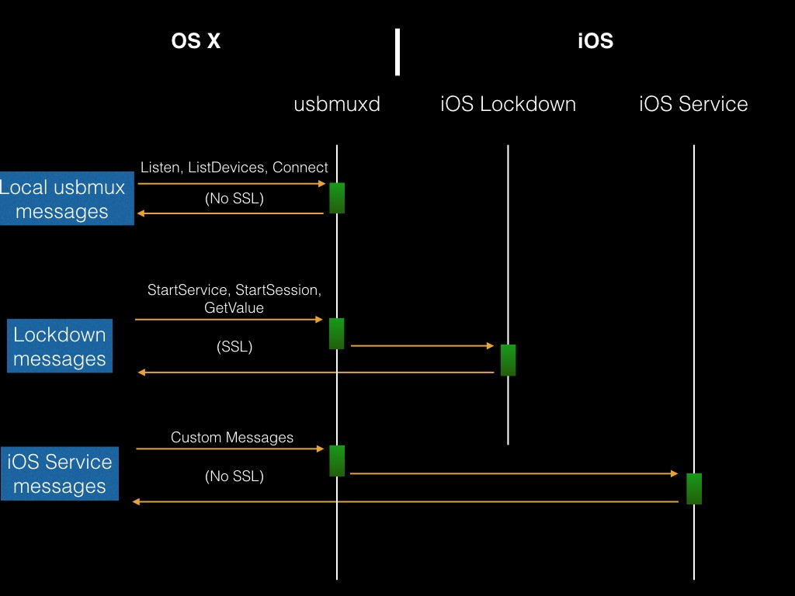

# The Communication Format
Almost in its entirety, the data format for requests and responses of the usbmuxd is a packet with a header and payload. The header describes the bytes distribution of the message. The payload is an xml with plist DTD, sometimes in a binary format (bplist). Bellow we can see the first message after a device is connected to the USB.

```
REQUEST

<?xml version="1.0" encoding="UTF-8"?>
<!DOCTYPE plist PUBLIC "-//Apple//DTD PLIST 1.0//EN" "http://www.apple.com/DTDs/PropertyList-1.0.dtd">
<plist version="1.0">
<dict>
	<key>ClientVersionString</key>
	<string>usbmuxd-474.120.1</string>
	<key>DeviceID</key>
	<integer>329</integer>
	<key>MessageType</key>
	<string>Connect</string>
	<key>PortNumber</key>
	<integer>32498</integer>
	<key>ProcessID</key>
	<integer>135</integer>
	<key>ProgName</key>
	<string>usbmuxd</string>
</dict>
</plist>
```

```
RESPONSE

<?xml version="1.0" encoding="UTF-8"?>
<!DOCTYPE plist PUBLIC "-//Apple//DTD PLIST 1.0//EN" "http://www.apple.com/DTDs/PropertyList-1.0.dtd">
<plist version="1.0">
<dict>
	<key>MessageType</key>
	<string>Result</string>
	<key>Number</key>
	<integer>0</integer>
</dict>
</plist>
```

Often the messages would have a "MessageType" field describing the context, and the request would be a command, like in this case "Connect". The arguments in the above message are "deviceID 329" and "to port 32498". The port number is in big endian, translated is 62078, which is the lockdown port number. The devices are identified by an ordinal number, in this case, DeviceID 13.
The response would have as well a "MessageType" telling is a "Result" and a "Number" value of 0 in case of success.

# The Scope of the Messages
The messages that the usbmuxd can process could be divided in three categories:

1. Local messages to the usbmuxd. Processed by the OSX usbmuxd daemon, do not reach the device. They are: Listen, Connect, ListDevices, ListListeners, ReadBUID, ReadPairRecord, SavePairRecord, DeletePairRecord. No encrypted.
2. Messages to the iOS Lockdown Service. They reach to the iOS Lockdown through port 62078. They are: StartSession, StopSession, StartService, GetValue. Once the start Session is requested the messages will will be SSL encrypted.
3. Messages to iOS Services. They reach to specific iOS service ports. The services are launched requesting "StartService" tot he Lockdown. No SSL.

The three different type of messages that can be send using the usbmuxd. 



# The Connection Protocol

When a device is connected, the usbmuxd service detects the device and adds it to his list of devices. Every device in the list will be given a sequential ordinal ID.
As mentioned above, the first message requests a "Connect" to the iOS TCP port 62078 of the lockdown service. This port is always open on an iOS device as it is created by the lockdown daemon.

The next step is to request "QueryType", and the response is "com.apple.mobile.lockdown" which confirms that we got connected to the lockdown service.

It follows the preparation for the device pairing with the host computer by requesting "ReadBUID". The response return the 40char BUID of the host machine.

Next step is a request for the "ReadPairRecord", which response should be the whole pairing record kept on the iOS for the given host machine. AS we saw in the previous article, the pairing record contains the SystemBUID, HostID, RootDertificate, DeviceCertificate and HostCertificate.

Finally it comes a "Request" to "StartSession" with the lockdown service. The system BUID is provided. If pairing matches, the response will request to enable an SSL session and will return the session ID.
From this moment on the communication with the lockdown service is valid and messages can be exchanged to request actions to the iOS service. All the communication in this socket will be encrypted from now on.

# Connecting to iOS TCP-IP Sockets

There is something really powerful in the "Connect" request to "PortNumber" we've just seen. It basically enables a TCP-IP tunnel from a socket to the UNIX socket "/var/run/usbmuxd" to any TCP-IP socket on the iOS device.

As we already said, the iOS Lockdown Service opens an iOS socket server in localhost:62078. Asking to the usbmuxd to connect to 62078, it is actually enabling our socket in an OSX App to talk TCP with an iOS TCP socket server on the device. Where it gets really interesting is that this is not only possible to do so with the lockdown related ports, but with any socket server we may open from our iOS Apps.
This capacity of tunnelling to any iOS socket server is the fundamental building block of the Lockdown Service to allow Apps like Xcode and iTunes to have control over Apps and data. With this information we can better understand the diagram at the beginning of the article.

# Connecting to iOS Services

For iTunes and Xcode to be able to install and remove Apps, read and write data, debug Apps, handle provisioning files etc. would require a large monolithic Lockdown Service to provide the API for all capabilities that could be reached from a host computer.

Apple has preferred to enable the access to the single iOS services in charge of every aspect of iOS worth being accessible from the host. The services that are accessible from the host do open a TCP socket server in the localhost and the Lockdown Service will create the tunnel by the "Connect" request to "PortNumber". This is certanly a more modular way to the solution, more dynamic and lower maintenance.

The list of services the Lockdown offers access to is described in the /System/Library/Lockdown/Services.plist file. There are other services added when the developer image is mounted. We can see those service in the DeveloperImage.dmg

Services added by the Developer Image.The way to open a connection to a service is by first sending a "StartService" "Request" to the lockdown service with the name of the "Service".

