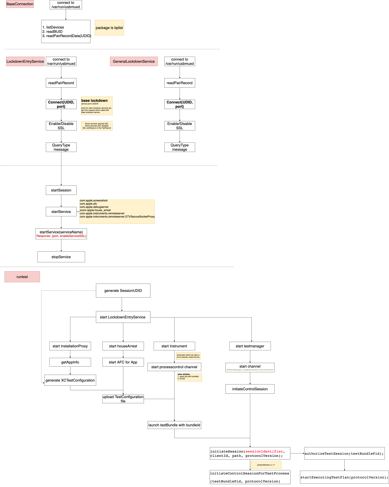

# Lockdown and DTXmessage
## MindMap of lockdown and runtest



## Lockdown 
### Lockdown message structure (plist)

```xml
<?xml version="1.0" encoding="UTF-8"?>
<!DOCTYPE plist PUBLIC "-//Apple//DTD PLIST 1.0//EN" "http://www.apple.com/DTDs/PropertyList-1.0.dtd">
<plist version="1.0">
<dict>
	<key>Request</key>
	<string>QueryType</string>
	<key>Label</key>
	<string>iTunes</string>
</dict>
</plist>


```

## AFC

### AFC Message Structures

| Layout    | Note     | Note 2 |
| --------- | -------- | ------ |
| header    | 40 bytes |        |
| data      | 32 bytes |        |
| extraData | 32 bytes |        |

### AFCHeader (40 bytes)

| Layout       | Note    | Note 2                     |
| ------------ | ------- | -------------------------- |
| magic        | 8 bytes | fixed: "CFA6LPAA"          |
| entireLength | 8 bytes | thisLength + extraDataSize |
| thisLength   | 8 bytes | headerSize + dataSize      |
| packetNumber | 8 bytes |                            |
| operation    | 8 bytes |                            |

## DTX (instruments & testmanager)

### DTX Message Structures

#### Overview DTX structure

| Layout               | Note                       | Note 2                                                             |
| -------------------- | -------------------------- | ------------------------------------------------------------------ |
| Header               | 32 bytes                   | if fragment count > 1 you will get following header 2 header 3 etc |
| Header 2             | 32 bytes                   |                                                                    |
| Header 3             | 32 bytes                   |                                                                    |
| Header N             | 32 bytes                   |                                                                    |
| PayloadHeader        | 16 bytes                   |                                                                    |
| PayloadObject        | Selector(Archived bplist)  | \_requestChannelWithCode:identifier:                               |
| AuxiliaryBlockHeader |                            | magic + length + buffer size                                       |
| AuxiliaryObjects     | Arguments(Archived bplist) | 1 com.apple.instruments.server.services.processcontrol             |

> When parse DTXMessage, the first step is read one DTXMessageHeader, you will get the fragmentCount and length info from it.
> If `fragmentCount > 1`, you should read `fragmentCount - 1` more headers right away. Then plus all length in these headers together, the total length is the data length

#### DTX Message Header

| Layout            | Note    | Note 2            |
| ----------------- | ------- | ----------------- |
| magic             | 4 bytes | fixed: 0x1f3d5b79 |
| cb                | 4 bytes | fixed: 0x20       |
| fragmentId        | 2 bytes | usually it's 0    |
| fragmentCount     | 2 bytes | usually it's 1    |
| length            | 4 bytes | data length       |
| identifier        | 4 bytes | message id        |
| conversationIndex | 4 bytes |                   |
| channelCode       | 4 bytes |                   |
| expectsReply      | 4 bytes | 1 or 0            |

#### DTX Payload Header

| Layout          | Note    | Note 2                           |
| --------------- | ------- | -------------------------------- |
| flags           | 4 bytes | usually 2                        |
| auxiliaryLength | 4 bytes | auxiliary header + body          |
| totalLength     | 8 bytes | payload length + auxiliaryLength |

#### DTX Auxiliary Header

| Layout     | Note    | Note 2                                 |
| ---------- | ------- | -------------------------------------- |
| length     | 4 bytes | auxiliary body length                  |
| bufferSize | 4 bytes | buffSize is 0x1F0, 0x2F0, 0x3F0, 0x4F0 |

#### DTX Auxiliary DataType

| DataType | Type | Note                                       |
| -------- | ---- | ------------------------------------------ |
| int32    | 3    | magic + type + length(4)                   |
| int64    | 6    | magic + type + length(8)                   |
| object   | 2    | magic + type + length(4) + archived_bplist |

#### Archived plist
The archived object of `_requestChannelWithCode:identifier:` is

```xml
<?xml version="1.0" encoding="UTF-8"?>
<!DOCTYPE plist PUBLIC "-//Apple//DTD PLIST 1.0//EN" "http://www.apple.com/DTDs/PropertyList-1.0.dtd">
<plist version="1.0">
<dict>
	<key>$version</key>
	<integer>100000</integer>
	<key>$archiver</key>
	<string>NSKeyedArchiver</string>
	<key>$objects</key>
	<array>
		<string>$null</string>
		<string>_requestChannelWithCode:identifier:</string>
	</array>
	<key>$top</key>
	<dict>
		<key>root</key>
		<dict>
			<key>CF$UID</key>
			<integer>1</integer>
		</dict>
	</dict>
</dict>
</plist>
```
