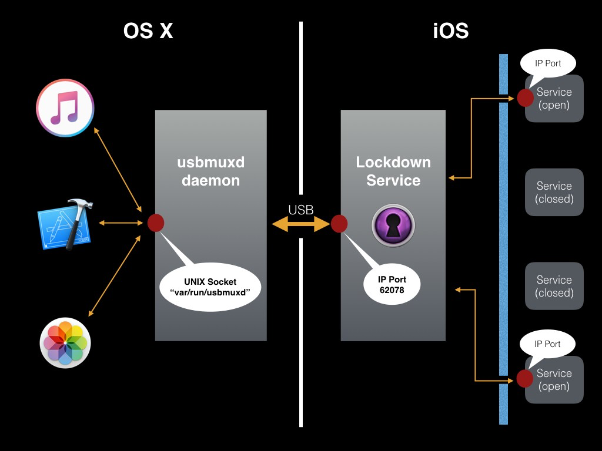

# Overview of the USBMUXD Communication System
***
The usbmuxd (usb multiplexer daemon) is the OSX process that allows applications to communicate with iOS devices via USB. The usbmuxd creates a UNIX socket at "/var/run/usbmuxd" for any application to connect and send requests via sockets to iOS devices. The sockets packets will be tunnelled via USB to the iOS Lockdown Service. The usbmuxd is as well in charge of detecting device connections and disconnections and to keep a list of them.

The Lockdown Service is the iOS process that communicates with the usbmuxd to execute its requests. It creates a socket at localhost:62078 (on the iDevice) for communication. The responses from the Lockdown will tunnelled back to the OSX usbmuxd.

The Lockdown Service provides some basic commands to get/set information to the device in a secure way (SSL). In addition serves as a gateway to reach to a large number of iOS services that allow iTunes and Xcode to do their operations. Those iOS services will open a TCP socket to communicate with Mac OSX Apps directly.

***

